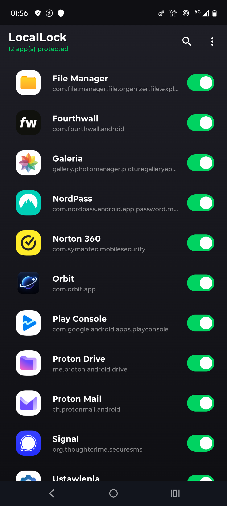
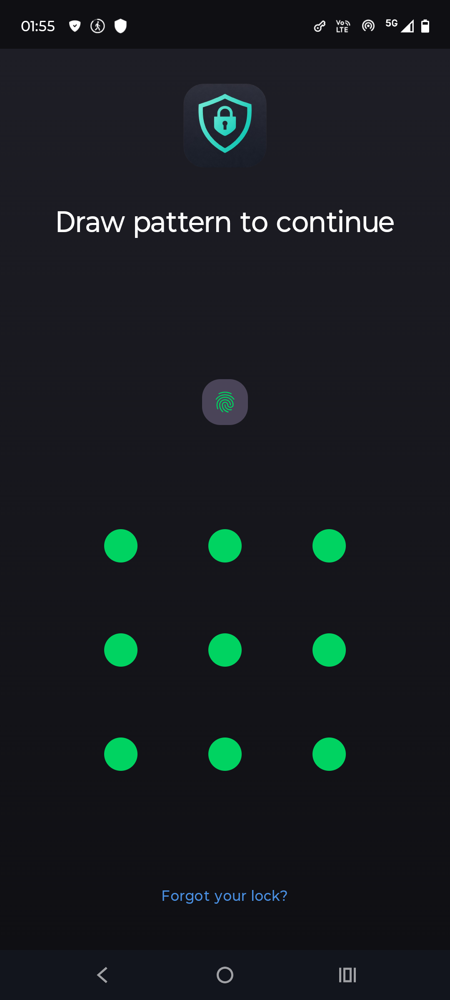
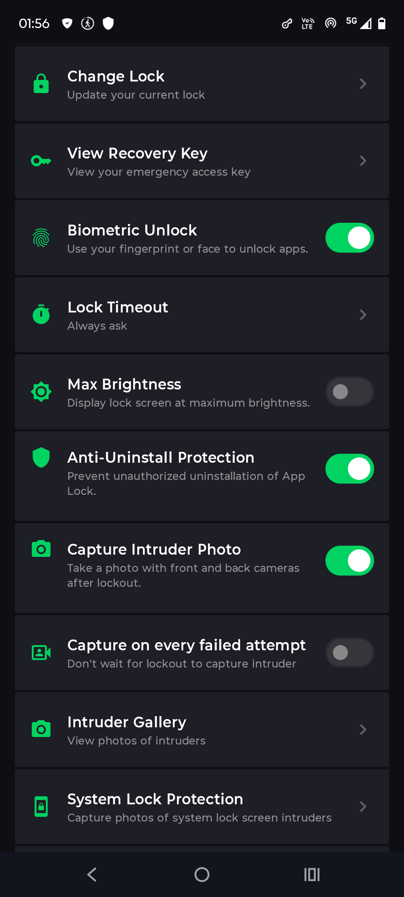
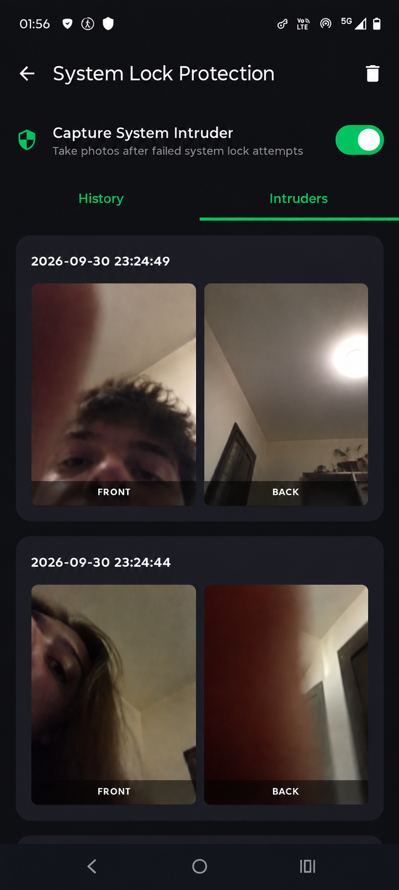
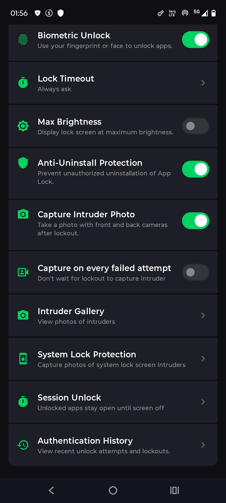
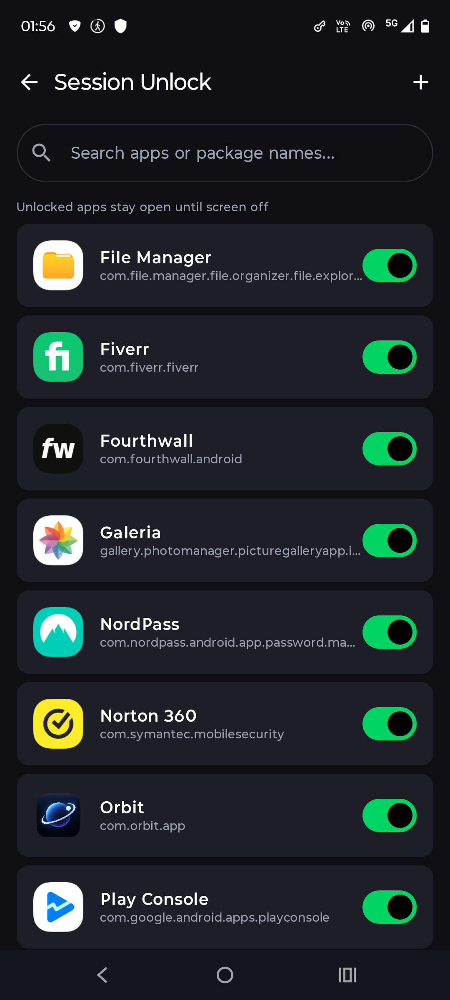
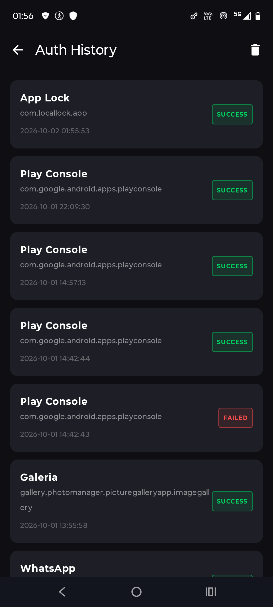

# LocalLock – App Lock & Privacy

**LocalLock** is an Android app protection tool. It lets users lock selected applications behind a PIN, password, pattern/symbol or biometric authentication, and it takes a photo when someone makes an incorrect access attempt, helping the owner identify unauthorized access.

**Google Play:** https://play.google.com/store/apps/details?id=com.locallock.app

---

## Core Idea

Phones hold private chats, photos, files, passwords and financial apps. LocalLock adds a separate layer of protection on top of the system lock screen, so that even someone with access to an unlocked phone cannot open the most sensitive apps. If someone tries to get in and fails, the app records who it was.

## Who It's For

- users who share their phone with family, friends or coworkers,
- people who keep sensitive apps such as messengers, mail, cloud storage, password managers or banking tools on their device,
- anyone who wants to know if someone tried to snoop around their apps,
- privacy-conscious users who want more control over app access.

## How It Works

1. The user sets a lock method (PIN, password, pattern/symbol) and receives a recovery key for emergencies.
2. They choose which apps to protect from the app list.
3. When a protected app is opened, LocalLock shows a lock screen and asks for authentication.
4. A correct pattern, code or biometric scan opens the app.
5. Failed attempts are logged, and an intruder photo can be captured with the front and back cameras.
6. The user can later review the authentication history and the intruder gallery.

---

## Key Features

### App Protection

The main screen lists installed apps with a simple switch next to each one. Turning a switch on locks that app, and a counter at the top shows how many apps are currently protected. The list can be searched, so even long app lists are easy to manage. Typical protected apps include file managers, galleries, password managers, security tools, cloud storage, mail and messengers.

  

### Authentication

Protected apps are guarded by a lock screen that requires the user to authenticate before continuing. Supported methods are PIN, password, pattern/symbol and biometric unlock (fingerprint or face). A fingerprint shortcut is shown right on the lock screen, and a **Forgot your lock?** option leads to recovery.

  

### Intruder Detection

LocalLock can photograph anyone who fails to unlock an app. Pictures are taken with both the front and back cameras, giving the owner a view of the person and their surroundings. Related options:

- **Capture Intruder Photo** - take photos after a lockout,
- **Capture on every failed attempt** - do not wait for a lockout, capture right away,
- **Intruder Gallery** - browse all captured photos,
- **System Lock Protection** - also capture photos when someone fails the phone's own system lock screen.

  
  &nbsp;&nbsp;
  

Each intruder entry shows a timestamp together with the front and back camera shots. The screen also has a quick switch for system intruder capture and a History tab.

### Session Unlock

Session Unlock keeps selected apps open after they are unlocked, until the screen turns off. This removes repeated prompts for apps the user opens often, while still locking them again once the phone goes to sleep. The list is searchable and apps can be added or removed individually.

  
  &nbsp;&nbsp;
  

### Authentication History

A full log of unlock attempts is available in one place. Each entry shows the app name, its package name, the exact date and time, and whether the attempt ended in **SUCCESS** or **FAILED**. This makes it easy to spot suspicious activity, and the history can be cleared at any time.

  

---

## Security and Privacy Settings

| Setting | Purpose |
|---|---|
| Change Lock | Update the current lock method |
| View Recovery Key | Access the emergency key if the lock is forgotten |
| Biometric Unlock | Use fingerprint or face to unlock apps |
| Lock Timeout | Control when the lock is asked for again |
| Max Brightness | Show the lock screen at maximum brightness |
| Anti-Uninstall Protection | Prevent unauthorized uninstallation of the app |
| Capture Intruder Photo | Take front and back photos after lockout |
| Capture on every failed attempt | Capture an intruder photo without waiting for lockout |
| Intruder Gallery | View photos of intruders |
| System Lock Protection | Capture photos of system lock screen intruders |
| Session Unlock | Keep unlocked apps open until the screen is off |
| Authentication History | Review recent unlock attempts and lockouts |

## Summary

LocalLock combines app locking, flexible authentication, intruder photo capture and a detailed activity log. It protects individual apps, helps identify unauthorized access attempts and keeps the owner informed about everything that happens around their private data.
