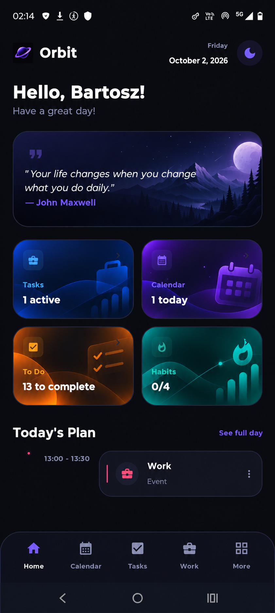
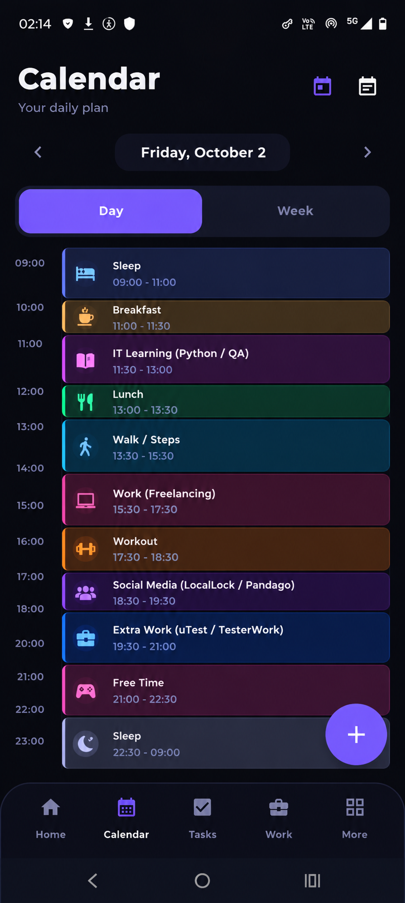
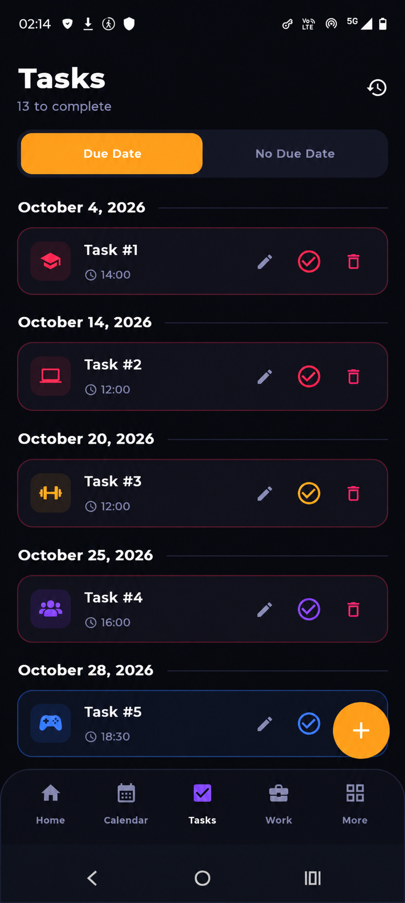
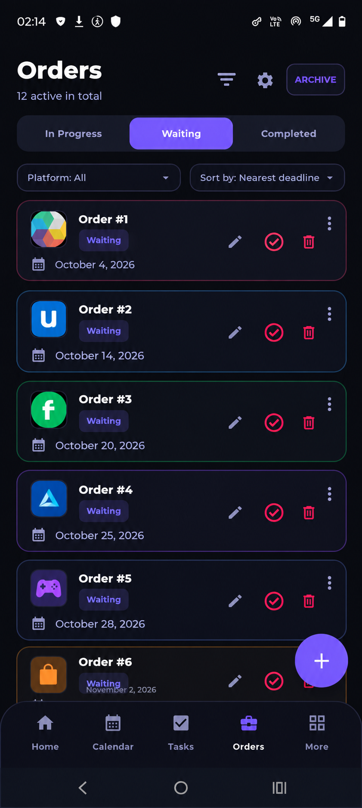
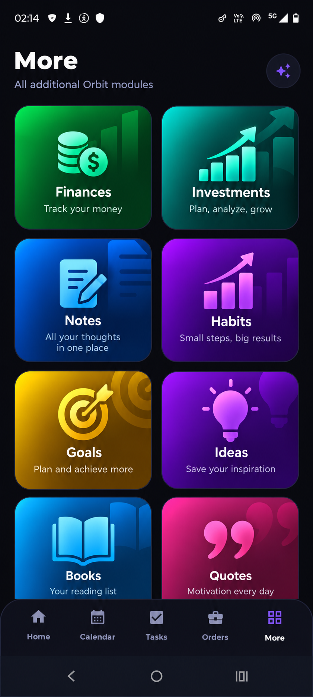

# Orbit

**Orbit** is a personal productivity and life-management app for Android. It brings the main areas of everyday life into one place: tasks, calendar, orders and work, finances, investments, habits, goals, notes, ideas, books and quotes.

> **Project status:** Orbit is a private personal project. It was developed exclusively for the author's own use and is **not a publicly released application**. It is not available on Google Play or any other store.

---

## Core Idea

Instead of juggling separate apps for planning, to-do lists, freelance work, money and self-development, Orbit combines everything in a single dark, focused interface. The app is built around the author's own daily routine, so every module exists because it solves a real, personal need.

## Purpose

- keep the whole day planned and visible at a glance,
- track tasks and deadlines without losing anything,
- manage freelance and extra work orders with statuses and deadlines,
- keep personal finances and investments under control,
- build better habits and work toward long-term goals,
- store notes, ideas, books and motivational quotes in one place.

## How It Works

1. The **Home** screen gives a daily overview with a greeting, a motivational quote, key counters and today's plan.
2. The bottom navigation switches between the core modules: Home, Calendar, Tasks, Orders (Work) and More.
3. The user adds items with the floating plus button in each module.
4. Items can be edited, completed or deleted directly from the list.
5. Additional modules such as finances, habits or notes are available in the **More** section.

---

## Main Sections

### Home

The home screen is the daily dashboard. It shows a greeting with the current date, a daily motivational quote and four quick summary cards:

- **Tasks** - number of active work tasks,
- **Calendar** - number of events scheduled for today,
- **To Do** - number of items left to complete,
- **Habits** - progress of today's habits.

Below the cards, **Today's Plan** lists the upcoming events of the day, with a **See full day** link leading to the calendar.

  

### Calendar

The calendar presents the daily plan as a color-coded timeline. Each block has an icon, a title and a time range, so the day can be read quickly, from sleep and meals through learning, work and workouts to free time. It supports a **Day** view and a **Week** view, with arrows for moving between dates and a button for adding new events.

  

### Tasks

The task list helps keep personal to-dos organized:

- two tabs: **Due Date** and **No Due Date**,
- tasks grouped by date, each with a time and a category icon,
- color-coded priority or category markers,
- quick actions to edit, complete or delete a task,
- a counter showing how many tasks are left to complete,
- a history view for finished tasks.

  

### Orders / Work

This module tracks freelance and extra work orders. Orders are split into three statuses: **In Progress**, **Waiting** and **Completed**. Each order shows its platform icon, status and deadline, and can be edited, marked as done or deleted. The list can be filtered by platform and sorted, for example by the nearest deadline. Finished orders can be moved to an **Archive**, and the header shows how many orders are currently active.

  

### More Modules

The **More** screen holds all additional Orbit modules, each with its own color and short tagline:

| Module | Description |
|---|---|
| Finances | Track your money |
| Investments | Plan, analyze, grow |
| Notes | All your thoughts in one place |
| Habits | Small steps, big results |
| Goals | Plan and achieve more |
| Ideas | Save your inspiration |
| Books | Your reading list |
| Quotes | Motivation every day |

  

---

## Key Features

- all-in-one personal dashboard with a daily overview,
- day and week calendar with a color-coded timeline,
- task management with due dates, history and quick actions,
- order tracking with statuses, platform filter, sorting and archive,
- finance and investment modules for money management,
- habits and goals for personal development,
- notes, ideas, books and quotes for knowledge and inspiration,
- consistent dark interface with a fast bottom navigation.

## Summary

Orbit is a private, custom-built life-management tool that replaces several separate apps with a single one tailored to its author's daily routine. It is a personal project and is not intended for public distribution.
