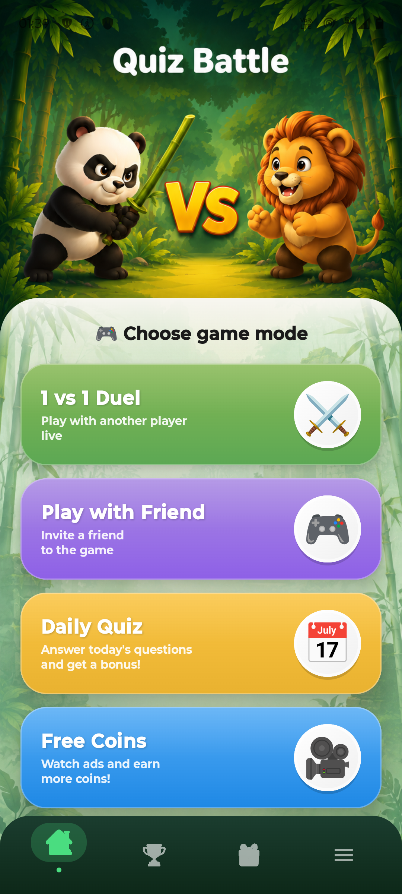
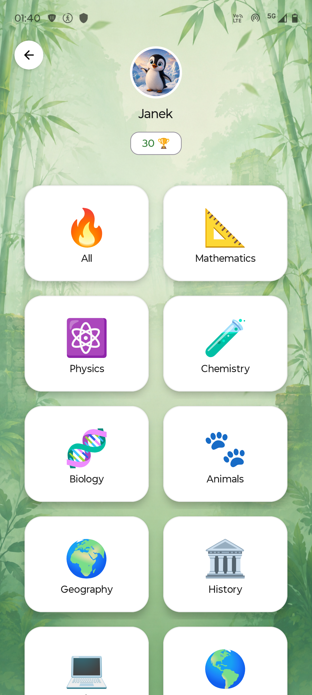
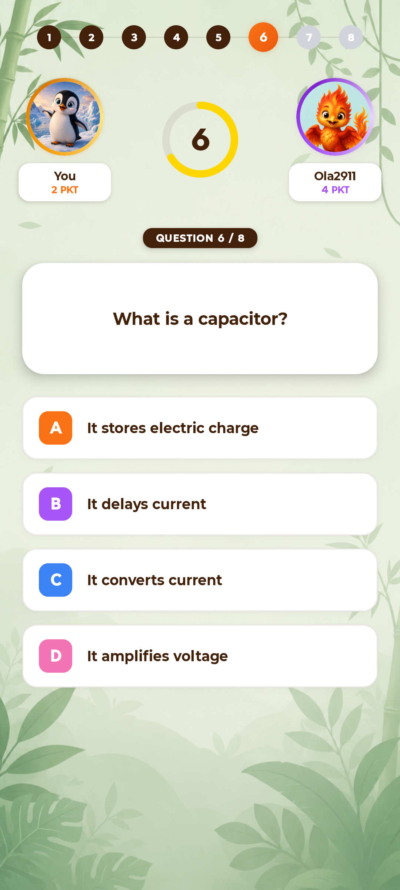
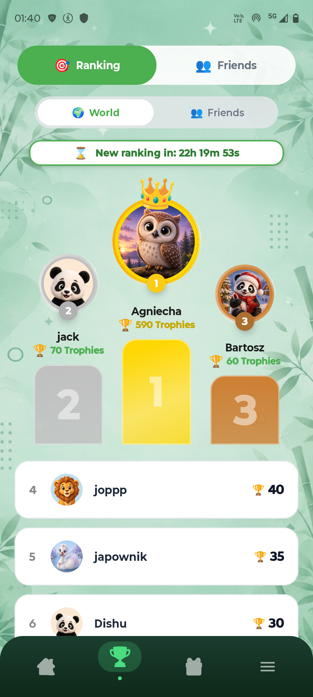
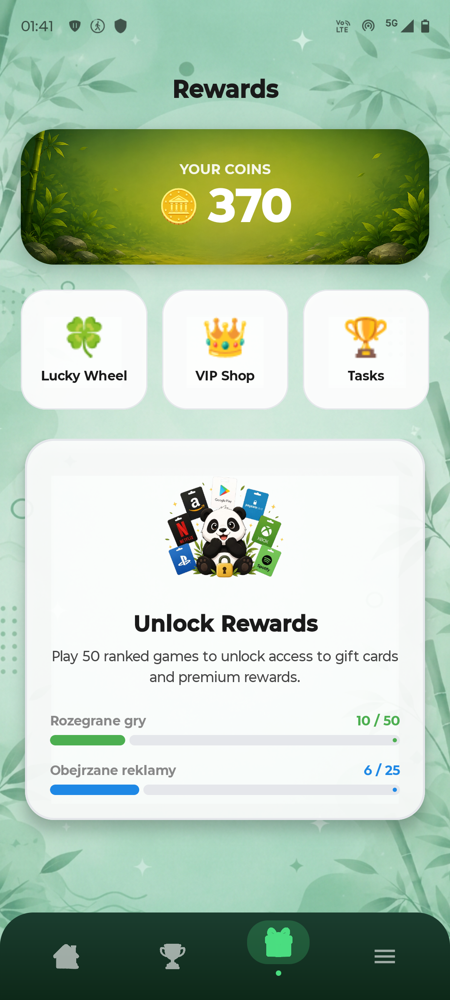
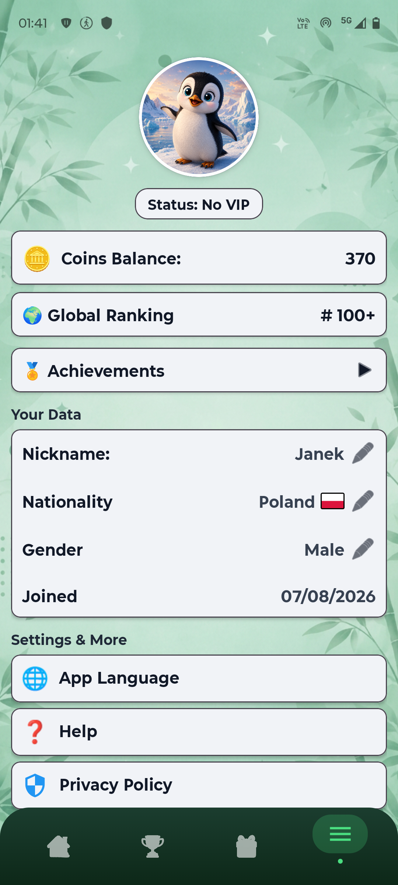

# Pandago: Quiz Battle & Rewards

**Pandago** is an Android mobile app built around quizzes and rewards. Users compete against other players, earn points and coins, and can then exchange them for rewards, including gift cards.

**Google Play:** https://play.google.com/store/apps/details?id=com.pandago.app

---

## Core Idea

Pandago combines learning and competition with real motivation. Players answer questions from many fields of knowledge, duel other players live, climb the rankings and collect coins. Coins and in-app activity unlock rewards.

## Who It's For

- people who enjoy quizzes and competition,
- students who want to test their knowledge in a game format,
- mobile gamers looking for short, dynamic matches,
- users who want to earn rewards for their activity.

## How It Works

1. The user creates an account and sets up a profile (nickname, country, avatar).
2. They pick a game mode and a question category.
3. They answer timed questions and earn points.
4. Wins affect their trophy count and ranking position.
5. Earned coins are collected and used in the rewards section.
6. After meeting the requirements (ranked games played and ads watched), access to gift cards and premium rewards is unlocked.

---

## Key Features

### Game Modes

The home screen offers four modes:

- **1 vs 1 Duel** - a live match against another player,
- **Play with Friend** - invite a friend to a shared game,
- **Daily Quiz** - daily questions with a bonus for completing them,
- **Free Coins** - extra coins for watching ads.

The bottom navigation gives quick access to home, ranking, rewards and profile.

  

### Category Selection

Before a match, the player chooses a question category: **All**, mathematics, physics, chemistry, biology, animals, geography, history and more. The top of the screen shows the player's avatar, nickname and trophy count.

  

### Duel Gameplay

A match consists of **8 questions**. Each question has four answers (A, B, C, D) and a countdown timer. A progress bar, the player's own score and the opponent's score are visible throughout, which keeps every duel tense and engaging.

  

### Rankings

The ranking is based on **trophies** earned in games. Two views are available:

- **World** - a global player list with a podium for the top three,
- **Friends** - a ranking among friends.

The ranking is refreshed periodically, and a countdown shows the time left until the next one.

  

### Rewards

The rewards section is the heart of the motivation system:

- coin balance overview,
- **Lucky Wheel** - a wheel of fortune,
- **VIP Shop** - a shop with VIP benefits,
- **Tasks** - tasks to complete,
- **Unlock Rewards** - access to gift cards (e.g. Google Play, Amazon, Netflix, Xbox, PlayStation, Spotify) after playing 50 ranked games. Progress bars show games played and ads watched.

  

### User Profile

The profile holds the most important account information:

- VIP status,
- coin balance and global ranking position,
- achievements,
- user data: nickname, nationality, gender, join date (editable),
- settings: app language, help, privacy policy.

  

---

## Tech Stack

- **Kotlin** - app language
- **Android Studio** - development environment
- **Firebase** - backend services
- **REST API** - communication between the app and the server
- **PostgreSQL** - database (accounts, quizzes, results, rewards)

## System Scope

The app covers user accounts, points and coins, quizzes, rankings and rewards.
